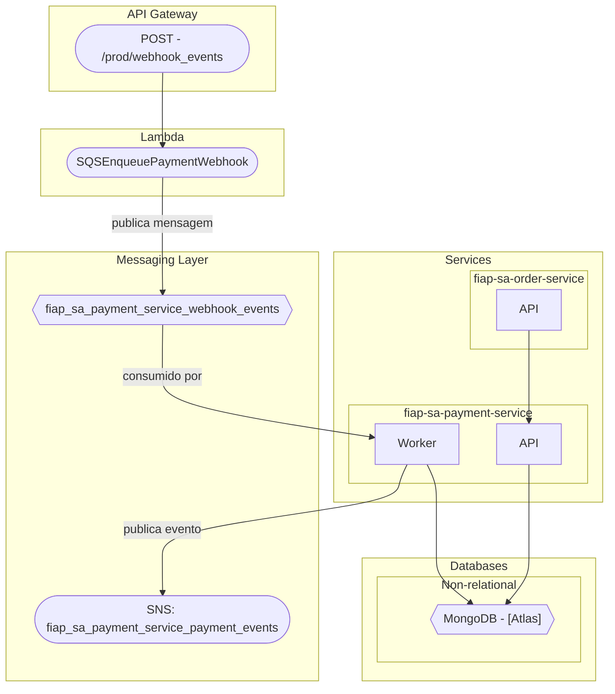

# FiAP SA Payment Service

[](https://codecov.io/gh/KauanCarvalho/fiap-sa-payment-service)
[](https://sonarcloud.io/summary/new_code?id=KauanCarvalho_fiap-sa-payment-service)

## 🌐 Represetação da comunicação deste serviço com os demais

**PS**: Para visualização completa da arquitetura visite [este link](https://github.com/KauanCarvalho/fiap-sa-infra/tree/main?tab=readme-ov-file#-represeta%C3%A7%C3%A3o-da-comunica%C3%A7%C3%A3o-entre-os-servi%C3%A7os).



## 📦 Sobre o Projeto

Este é o serviço de **pagamentos** da arquitetura do Tech Challenge.
Ele é responsável por gerenciar as operações relacionadas aos pagamentos, incluindo:

- Autorização de pagamentos
- Recebimento de webhooks vindo do **API Gateway** que é enfileirado no **SQS** através de um **lambda**.
- Propagação do evento de atualização de um pagamento, através do **SNS**.

---

### Documentação Swagger

A documentação da API é gerada automaticamente com o comando:

```bash
make swag
```

Os arquivos são gerados em:

- `swagger/swagger.json`
- `swagger/swagger.go`

---

### ☁️ SonarCloud

Este repositório está integrado ao **SonarCloud**, que realiza análise de qualidade de código, detectando problemas como bugs, code smells, vulnerabilidades e cobertura de testes.

Arquivo de configuração: [`sonar-project.properties`](./sonar-project.properties)

**Exclusões definidas:**

- **Análise completa:**  
  `**/*_test.go`, `internal/config/**`, `internal/di/**`, `swagger/**`, `cmd/**`, `internal/adapter/api/api.go`
  
- **Análise de duplicidade apenas:**  
  Mesmos paths acima (para não contaminar os relatórios)

---

### 🛑 Codecov

A cobertura de testes é enviada ao **Codecov** a cada pull request ou push na branch `main`.

Arquivo de configuração: [`codecov.yml`](./.codecov.yml)

**Exclusões definidas:**

- `swagger/**`
- `cmd/**`
- `internal/config/**`
- `internal/di/**`
- `internal/adapter/api/api.go`

---

### 🔄 GitHub Actions: Pipelines Automatizadas

O projeto utiliza **GitHub Actions** com as seguintes etapas automatizadas a cada Pull Request ou push:

| Pipeline           | Descrição                                                                 |
|--------------------|---------------------------------------------------------------------------|
| **Lint**           | Executa `golangci-lint` para garantir que o código siga os padrões        |
| **Testes**         | Roda os testes tradicionais com cobertura                                 |
| **Testes BDD**     | Executa testes de comportamento (BDD) com Gherkin e validação real no DB  |
| **Swagger**        | Gera a documentação OpenAPI automaticamente                               |
| **Codecov**        | Envia os relatórios de cobertura de testes para o Codecov                 |
| **SonarCloud**     | Envia o projeto para análise de qualidade e cobertura de código           |
| **DeployEKS**      | Deploy é feito aplicando os maninfestos do k8s no cluster                 |

#### 🚀 Pipeline de Deploy para o EKS

Esta pipeline automatiza o processo de **build**, **push da imagem para o Amazon ECR** e **deploy para o Amazon EKS**! Ela é acionada sempre que há um **push** para a branch `main`, ou por gatilho manual no _GITHUB ACTIONS__ garantindo que o serviço esteja sempre com a versão mais recente do código ✨!

##### Etapas principais:

1. **Checkout do código:** 🚦 Começamos pegando o código mais recente do repositório.
   
2. **Geração de tag para a imagem:** 🏷️ Uma tag única é gerada para a imagem Docker com o nome da aplicação, timestamp e o hash do commit.

3. **Configuração das credenciais da AWS:** 🔑 As credenciais necessárias para interagir com os serviços da AWS são configuradas, permitindo o login no **Amazon ECR**, todas as credenciais necessárias se encontram no _secrets_ do repositório.

4. **Build e Push das imagens:**
   - **Imagem da aplicação (APP):** 🖼️ A imagem Docker da aplicação é construída e enviada para o Amazon ECR.
   - **Imagem de Migração (MIGRATE):** 🔄 Uma imagem separada para as migrações do banco de dados também é construída e enviada ao ECR.

5. **Instalação do kubectl:** 💻 O `kubectl` é instalado para permitir a comunicação com o nosso cluster Kubernetes.

6. **Atualização do Kubeconfig:** 🌐 O `kubeconfig` é atualizado, garantindo que a pipeline consiga se conectar ao cluster EKS.

7. **Substituição de variáveis nos manifests Kubernetes:** 🔄 Variáveis de ambiente, como credenciais do banco de dados, são substituídas nos arquivos de configuração Kubernetes, utilizando o conceito de _template_.

8. **Validação dos manifests Kubernetes:** ✅ Antes de aplicar as alterações no cluster, validamos todos os manifests para evitar erros de configuração.

9. **Execução das migrações de banco de dados:** 🗂️ Um pod volátil é criado para rodar as migrações no banco de dados, garantindo que tudo esteja no lugar. **Isso ajuda a manter o start do container mais rápido**, já que as migrações são feitas de forma independente antes do deploy da aplicação. Dessa forma, o container da aplicação não precisa esperar pela execução das migrações durante seu start (caso tenha), melhorando a performance e a experiência do usuário. Além disso, essa abordagem permite que as migrações sejam tratadas de forma isolada, sem sobrecarregar o serviço de produção, e pod é removido após realizar as migrações, outro ponto importante é que esta abordagem foi  escolhida por ser simples e permitir se conectar com o *RDS* que só aceitar conexões vindo de dentro do cluster.

10. **Aplicação dos manifests Kubernetes:** 🚀 Com tudo validado, aplicamos os manifests no cluster, incluindo configurações de ambiente, secrets, deployments, serviços e HPA (Horizontal Pod Autoscaler).

11. **Monitoramento do deploy:** 👀 O progresso do deploy é monitorado. Se algo der errado, mostramos os eventos mais recentes para ajudar na resolução!

## 🌍 Infraestrutura

O **cluster EKS** e o **ECR** são provisionados automaticamente usando **Terraform** no repositório [fiap-sa-infra](https://github.com/KauanCarvalho/fiap-sa-infra). Assim, quando a pipeline rodar, o cluster e o repositório ECR já estarão prontos para o deploy! 🎉

---

### Teste de conectividade + seed do ambiente externo 🛠️

O script `testdata/test-payment-service.sh` é uma ferramenta útil para validação e seed do ambiente de produção. Ele automatiza a criação de pagamentos, verificando a API para criar pagamentos utilizando o MOCK do Mercado Pago.

Funcionalidades:

- Healthcheck: Antes de realizar qualquer operação, o script verifica a saúde da API.
- Criação de Pagamentos: O script gera 5 pagamentos com preços e referências aleatórios e os insere na base de dados através da API.

#### Exemplo de uso:

# Rodando o script passando a URL base da API como parâmetro

```bash
./testdata/test-payment-service.sh http://example.com
```

OU

```bash
make test-payment-service http://example.com
```

## Executando o Projeto

Para instruções completas de execução do projeto, incluindo infraestrutura (Docker, Terraform, MongoDB, MySQL), acesse o repositório de infraestrutura:

🔗 [fiap-sa-infra (README)](https://github.com/KauanCarvalho/fiap-sa-infra)
